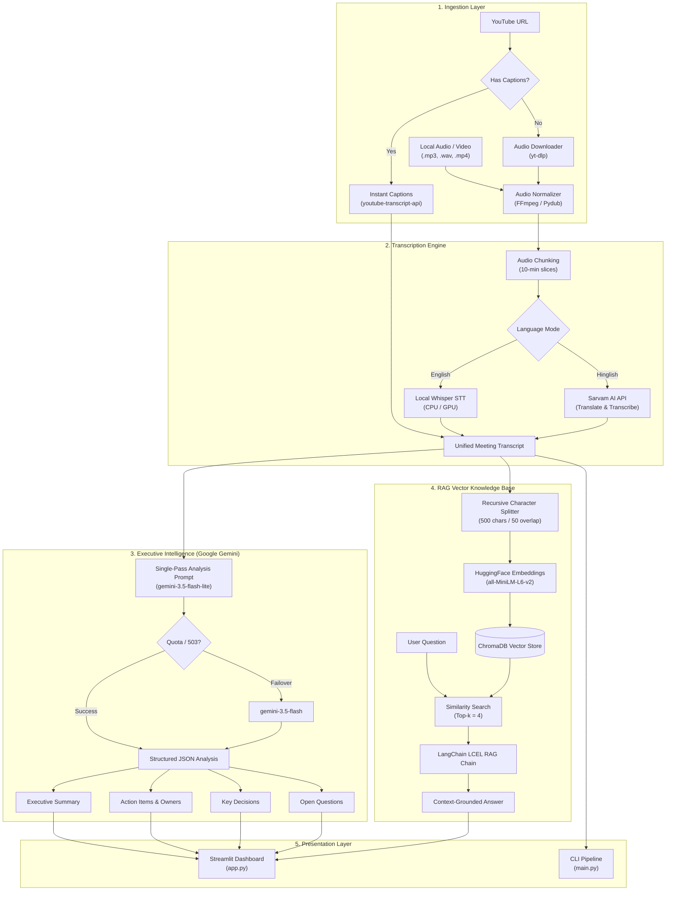

# ⚡ Video Agent — Intelligent Meeting RAG Assistant

[](https://www.python.org/)
[](https://python.langchain.com/)
[](https://aistudio.google.com/)
[](https://streamlit.io/)
[](https://www.trychroma.com/)
[](LICENSE)

An intelligent, full-stack meeting and video intelligence platform. **Video Agent** automatically ingests YouTube videos or local audio/video recordings, extracts transcripts, performs single-pass executive analysis (summaries, action items, decisions, follow-ups), and builds a semantic vector database so you can chat directly with your video content via **Retrieval-Augmented Generation (RAG)**.

---

## 📑 Table of Contents

- [Key Features](#-key-features)
- [System Architecture](#-system-architecture)
- [How It Works](#-how-it-works)
- [Repository Structure](#-repository-structure)
- [Prerequisites](#-prerequisites)
- [Installation & Setup](#-installation--setup)
- [Environment Configuration](#-environment-configuration)
- [Running the Application](#-running-the-application)
- [Troubleshooting & FAQs](#-troubleshooting--faqs)
- [License](#-license)

---

## 🌟 Key Features

- ⚡ **Instant YouTube Transcript Fetching (< 1s)**: Extracts existing auto-generated or uploaded captions directly via `youtube-transcript-api`, completely bypassing heavy 100MB+ audio downloads and 15-minute Whisper processing.
- 🎙️ **Local Speech-to-Text Fallback**: Seamless fallback to local **OpenAI Whisper** (`base` / `small` / `tiny`) with automatic chunking and audio normalization for local files or captionless videos.
- 🇮🇳 **Bilingual & Hinglish Support**: Built-in integration with **Sarvam AI** for Indian language speech-to-text translation.
- 🧠 **Single-Pass Executive Intelligence**: Uses **Google Gemini 3.5 Flash Lite** with automated fallback to **Gemini 3.5 Flash** to extract:
  - **Executive Summary**: Comprehensive, structured bullet points covering core insights.
  - **Action Items**: Task descriptions, assignees/owners, and deadlines.
  - **Key Decisions**: Crucial decisions agreed upon during the discussion.
  - **Open Questions**: Unresolved topics and items requiring follow-up.
- 🔍 **Interactive RAG Chat**: Indexes transcripts into a local **ChromaDB** vector database with **HuggingFace Embeddings** (`all-MiniLM-L6-v2`) and LangChain LCEL for hallucination-free, grounded Q&A.
- 🎨 **Modern High-Contrast Glassmorphic UI**: Premium Streamlit interface featuring **Plus Jakarta Sans** typography, ambient dark-mode styling, real-time multi-stage pipeline status tracker, and native interactive chat.
- 💻 **Dual Interfaces**: Run through either the full-featured **Streamlit Web UI** or the streamlined **CLI terminal pipeline**.

---

## 🏗️ System Architecture



---

## ⚡ How It Works

1. **Media Ingestion & Caption Bypass**:
   When you provide a YouTube URL, the agent first queries YouTube's caption servers using `youtube-transcript-api`. If subtitles are available, it retrieves the full transcript in under **0.5 seconds**, bypassing audio extraction completely.
2. **Audio Processing (Fallback)**:
   For local uploads or videos without subtitles, `yt-dlp` and `pydub` normalize the audio to 16kHz mono WAV format and transcribe it locally using OpenAI's Whisper model (`base` or `small`).
3. **Single-Pass Analysis**:
   Instead of burning rate limits across multiple LLM requests, the transcript is passed to a consolidated extraction prompt. **Google Gemini 3.5 Flash Lite** generates the session title, summary, action items, key decisions, and follow-ups in a single, high-speed call.
4. **Semantic Embedding & Vector Indexing**:
   The transcript is split into 500-character overlapping chunks, vectorized using `sentence-transformers/all-MiniLM-L6-v2`, and stored in a local ChromaDB collection.
5. **Interactive Q&A**:
   Whenever you ask a question in the chat interface, the retriever finds the top 4 most relevant transcript excerpts and feeds them to Gemini to synthesize an answer strictly grounded in what was said.

---

## 📂 Repository Structure

```text
Video_Agent/
├── app.py                     # Streamlit web application (UI & Chat)
├── main.py                    # CLI runner for terminal execution
├── requirements.txt           # Python dependencies
├── .env.example               # Environment variables template
├── .gitignore                 # Protected files (secrets, audio, database)
├── core/
│   ├── extractor.py           # Single-pass executive brief & item extraction
│   ├── summarizer.py          # Long-context summarizer & title generation
│   ├── rag_engine.py          # LangChain LCEL RAG question-answering chain
│   ├── transcriber.py         # Whisper & Sarvam AI transcription routing
│   └── vector_store.py        # ChromaDB setup & HuggingFace embeddings
└── utils/
    └── audio_processor.py     # YouTube instant caption fetcher, yt-dlp & pydub
```

---

## 🔧 Prerequisites

- **Python**: Version `3.10`, `3.11`, or `3.12` recommended.
- **FFmpeg**: Required by `pydub` and `yt-dlp` for audio processing.
  - **Windows**: Install via `winget install Gyan.FFmpeg` or download from [gyan.dev](https://www.gyan.dev/ffmpeg/builds/) and add the `bin` folder to your system `PATH`.
  - **macOS**: `brew install ffmpeg`
  - **Linux**: `sudo apt update && sudo apt install ffmpeg`
- **Google Gemini API Key**: Free API key from [Google AI Studio](https://aistudio.google.com/).
- *(Optional)* **Sarvam AI API Key**: Required only if transcribing Indian languages / Hinglish.

---

## 🚀 Installation & Setup

1. **Clone the Repository**:
   ```bash
   git clone https://github.com/Rudraraiyani1902/Video_Agent_RAG_Assistant.git
   cd Video_Agent_RAG_Assistant
   ```

2. **Create and Activate a Virtual Environment**:
   - **Windows (PowerShell)**:
     ```powershell
     python -m venv .venv
     .\.venv\Scripts\Activate.ps1
     ```
   - **macOS / Linux**:
     ```bash
     python3 -m venv .venv
     source .venv/bin/activate
     ```

3. **Install Dependencies**:
   ```bash
   pip install --upgrade pip
   pip install -r requirements.txt
   ```

---

## 🔑 Environment Configuration

Create a `.env` file in the root directory by copying `.env.example`:

```bash
cp .env.example .env
```

Open `.env` and fill in your keys:

```env
# Google Gemini API Key (Get free key from https://aistudio.google.com/)
GEMINI_API_KEY=your_gemini_api_key_here
GEMINI_MODEL=gemini-3.5-flash-lite

# Whisper model configuration: tiny, base, small, medium, large
# 'base' is recommended for fast CPU transcription
WHISPER_MODEL=base

# Sarvam AI API Key (Optional, for Indian languages / Hinglish STT)
SARVAM_API_KEY=your_sarvam_api_key_here
SARVAM_STT_MODEL=saaras:v2.5
```

---

## 💻 Running the Application

### 1. Web Dashboard (Streamlit)

Launch the interactive dark-mode dashboard:

```bash
streamlit run app.py
```

Once running, open your browser at **`http://localhost:8501`**.

- Paste any YouTube link or local file path in the sidebar.
- Click **✨ Analyze Video**.
- Monitor the live multi-stage pipeline.
- Review your **Executive Summary**, **Action Items**, **Key Decisions**, and chat with the built-in **RAG Assistant**!

### 2. Terminal Pipeline (CLI Mode)

To run without a browser interface directly in your terminal:

```bash
python main.py
```

Follow the interactive prompts to input your URL/file and chat with your transcript directly in the console.

---

## ❓ Troubleshooting & FAQs

### 1. `429 RESOURCE_EXHAUSTED` (Rate Limit Exceeded)
Google AI Studio free tier enforces strict per-model request limits on preview models (e.g. 20 requests/day on `gemini-3.6-flash`).
- **Solution**: The application defaults to `gemini-3.5-flash-lite` and uses LangChain's `.with_fallbacks([fallback_llm])` to automatically switch models if quota is saturated.

### 2. `FFmpeg not found`
If audio conversion fails with `FileNotFoundError: [WinError 2] The system cannot find the file specified`:
- **Solution**: Ensure FFmpeg is installed and `ffmpeg -version` outputs successfully in your terminal.

### 3. Whisper is slow on CPU
Whisper `small` contains 244M parameters and processes at ~0.3x real-time on CPU.
- **Solution**: Set `WHISPER_MODEL=base` or `tiny` in your `.env`. For YouTube videos, existing captions are fetched in < 1 second automatically without using Whisper.

---

## 📄 License

This project is licensed under the [MIT License](LICENSE).
